# Enhanced Entity Relationship Diagram (ERD)

## IT Delivery Dashboard Database Schema - Comprehensive Version

```mermaid
erDiagram
    USERS {
        int id PK
        varchar email UK
        varchar password_hash
        varchar name
        varchar role
        boolean is_active
        timestamp created_at
        timestamp updated_at
    }

    RESOURCES {
        int id PK
        varchar employee_id UK
        varchar first_name
        varchar last_name
        varchar email UK
        varchar personal_email
        varchar phone
        varchar emergency_contact_name
        varchar emergency_contact_phone
        date date_of_birth
        varchar gender
        varchar marital_status
        varchar nationality
        text address
        varchar designation
        varchar department
        varchar location
        varchar work_location
        varchar employment_type
        varchar employment_status
        date joining_date
        date probation_end_date
        varchar reporting_manager
        varchar reporting_manager_id
        varchar status
        varchar resource_type
        varchar experience_level
        int years_of_experience
        int experience_months
        json primary_skills
        json secondary_skills
        int primary_skills_experience
        int secondary_skills_experience
        json certifications
        varchar education_qualification
        json training_completed
        varchar cost_center
        decimal cost_rate
        decimal billing_rate
        decimal overtime_rate
        varchar currency
        date rate_effective_date
        varchar salary_currency
        decimal utilization_percentage
        decimal utilization_target
        decimal current_utilization
        decimal average_utilization_3m
        decimal average_utilization_6m
        int billable_hours_target
        int productivity_score
        decimal performance_rating
        date last_performance_review_date
        date next_performance_review_date
        int bench_days
        date bench_start_date
        varchar bench_reason
        date available_from_date
        date last_project_end_date
        varchar career_level
        date promotion_eligible_date
        decimal learning_budget
        decimal learning_budget_used
        decimal current_project_allocation
        decimal max_allocation_percentage
        varchar passport_number
        varchar visa_status
        date visa_expiry_date
        varchar tax_id
        varchar bank_account_number
        timestamp created_at
        timestamp updated_at
    }

    RESOURCE_SKILL_ASSESSMENTS {
        int id PK
        int resource_id FK
        varchar skill_name
        varchar skill_category
        varchar proficiency_level
        decimal proficiency_score
        decimal years_experience
        date last_assessed_date
        int assessed_by
        boolean certification_obtained
        varchar certification_name
        date certification_date
        date certification_expiry
        timestamp created_at
        timestamp updated_at
    }

    PROJECTS {
        int id PK
        varchar project_code UK
        varchar project_name
        varchar client_name
        varchar client_contact_email
        varchar client_contact_phone
        varchar project_manager
        int project_manager_id
        varchar technical_lead
        int technical_lead_id
        varchar delivery_owner
        int delivery_owner_id
        varchar status
        varchar project_type
        varchar health_status
        varchar risk_level
        varchar project_priority
        varchar methodology
        varchar billing_type
        date start_date
        date end_date
        date planned_end_date
        date actual_start_date
        date actual_end_date
        int estimated_hours
        int actual_hours
        decimal sow_value
        decimal budget_allocated
        decimal actual_cost
        decimal revenue
        decimal profit_margin
        decimal monthly_burn_rate
        varchar currency
        decimal on_time_percentage
        decimal utilization_rate
        decimal completion_percentage
        int scope_change_requests
        decimal change_request_value
        int defect_count
        int critical_defects
        decimal code_coverage_percentage
        decimal client_satisfaction_score
        date last_client_feedback_date
        int billable_resources_count
        int non_billable_resources_count
        int shadow_resources_count
        text description
        text objectives
        text deliverables
        text success_criteria
        text constraints
        text assumptions
        json technology_stack
        varchar current_milestone
        timestamp created_at
        timestamp updated_at
    }

    PROJECT_MILESTONES {
        int id PK
        int project_id FK
        varchar milestone_name
        text description
        varchar milestone_type
        date planned_date
        date baseline_date
        date actual_date
        varchar status
        decimal completion_percentage
        varchar priority
        json dependencies
        text deliverables
        text acceptance_criteria
        int owner_id
        int estimated_effort_hours
        int actual_effort_hours
        decimal budget_allocated
        decimal budget_consumed
        timestamp created_at
        timestamp updated_at
    }

    PROJECT_RISKS {
        int id PK
        int project_id FK
        varchar risk_title
        text risk_description
        varchar risk_category
        varchar probability
        varchar impact
        decimal risk_score
        varchar status
        int owner_id
        date identified_date
        text mitigation_plan
        text contingency_plan
        date review_date
        timestamp created_at
        timestamp updated_at
    }

    PROJECT_DELIVERABLES {
        int id PK
        int project_id FK
        varchar deliverable_name
        text description
        varchar deliverable_type
        date planned_delivery_date
        date actual_delivery_date
        varchar status
        decimal quality_score
        int responsible_resource_id
        int reviewer_id
        date client_acceptance_date
        int revision_count
        varchar file_path
        timestamp created_at
        timestamp updated_at
    }

    CLIENT_FEEDBACK {
        int id PK
        int project_id FK
        date feedback_date
        varchar feedback_type
        decimal overall_satisfaction
        decimal communication_rating
        decimal quality_rating
        decimal timeline_rating
        decimal value_rating
        text feedback_summary
        text improvement_suggestions
        text action_items
        boolean follow_up_required
        date follow_up_date
        timestamp created_at
        timestamp updated_at
    }

    PROJECT_ALLOCATIONS {
        int id PK
        int project_id FK
        int resource_id FK
        decimal allocation_percentage
        date start_date
        date end_date
        date planned_end_date
        varchar role_in_project
        text responsibilities
        varchar status
        decimal billing_rate
        decimal cost_rate
        decimal daily_hours
        decimal weekly_hours
        decimal overtime_hours
        decimal utilization_efficiency
        decimal skill_match_percentage
        decimal performance_rating
        text allocation_notes
        int created_by
        int approved_by
        date approval_date
        timestamp created_at
        timestamp updated_at
    }

    FINANCIALS {
        int id PK
        int project_id FK
        date month_year
        decimal planned_revenue
        decimal actual_revenue
        decimal invoiced_amount
        decimal collected_amount
        decimal outstanding_amount
        decimal planned_cost
        decimal actual_cost
        decimal resource_cost
        decimal infrastructure_cost
        decimal vendor_cost
        decimal overhead_cost
        decimal gross_margin
        decimal net_margin
        decimal margin_percentage
        decimal budget_variance
        decimal budget_variance_percentage
        decimal cost_variance
        decimal schedule_variance
        decimal forecasted_revenue
        decimal forecasted_cost
        decimal forecasted_margin
        varchar billing_cycle
        varchar currency
        decimal exchange_rate
        text financial_notes
        text risk_factors
        timestamp created_at
        timestamp updated_at
    }

    BENCH_COSTING {
        int id PK
        int resource_id FK
        date month_year
        decimal bench_cost
        decimal salary_cost
        decimal benefits_cost
        decimal overhead_cost
        decimal training_cost
        int bench_days
        int total_working_days
        int training_days
        int available_days
        varchar bench_reason
        varchar bench_category
        date expected_allocation_date
        text upskilling_activities
        varchar cost_center
        varchar department_code
        timestamp created_at
        timestamp updated_at
    }

    ESCALATIONS {
        int id PK
        varchar title
        text description
        int project_id FK
        varchar customer
        varchar client_contact_email
        varchar project_owner
        varchar escalation_owner
        varchar escalated_to
        varchar raised_by
        varchar assigned_to
        varchar escalation_type
        varchar category
        varchar priority
        varchar severity
        varchar status
        varchar resolution_status
        timestamp raised_date
        timestamp date_acknowledged
        timestamp target_resolution_date
        timestamp actual_resolution_date
        timestamp resolved_date
        timestamp date_closed
        decimal response_time_hours
        decimal resolution_time_hours
        text business_impact
        decimal financial_impact
        int affected_users
        decimal downtime_hours
        text root_cause
        text resolution_summary
        text actions_taken
        text preventive_measures
        text client_communication
        text internal_notes
        json communication_log
        boolean client_signoff_required
        timestamp client_signoff_date
        decimal client_satisfaction_rating
        timestamp created_at
        timestamp updated_at
    }

    %% Relationships
    RESOURCES ||--o{ RESOURCE_SKILL_ASSESSMENTS : "has_skills"
    RESOURCES ||--o{ PROJECT_ALLOCATIONS : "allocated_to"
    RESOURCES ||--o{ BENCH_COSTING : "has_bench_cost"
    PROJECTS ||--o{ PROJECT_MILESTONES : "contains"
    PROJECTS ||--o{ PROJECT_RISKS : "has_risks"
    PROJECTS ||--o{ PROJECT_DELIVERABLES : "produces"
    PROJECTS ||--o{ CLIENT_FEEDBACK : "receives_feedback"
    PROJECTS ||--o{ PROJECT_ALLOCATIONS : "requires"
    PROJECTS ||--o{ FINANCIALS : "has_financial_data"
    PROJECTS ||--o{ ESCALATIONS : "has_escalations"
```



## Enhanced Database Schema Features

### Comprehensive Resource Management
- **Complete Personal Information**: Full employee lifecycle data including visa, emergency contacts, career planning
- **Skills & Certifications**: Detailed skill assessments with proficiency levels and certification tracking
- **Performance Tracking**: Multi-dimensional performance metrics with historical trends
- **Financial Management**: Multiple rate types, currency support, and budget tracking

### Advanced Project Management
- **Multi-Stakeholder Tracking**: Project managers, technical leads, delivery owners
- **Comprehensive Timeline Management**: Planned vs actual dates, milestone tracking
- **Risk & Quality Management**: Integrated risk assessment and quality metrics
- **Client Relationship Management**: Satisfaction scores, feedback tracking, communication logs

### Enhanced Financial Tracking
- **Multi-Currency Support**: Exchange rates, multiple billing cycles
- **Comprehensive Cost Analysis**: Resource, infrastructure, vendor, and overhead costs
- **Advanced Forecasting**: Predictive financial modeling with variance analysis
- **Budget Management**: Variance tracking and performance analysis

### Sophisticated Escalation Management
- **Multi-Dimensional Classification**: Type, category, priority, severity levels
- **Impact Assessment**: Business, financial, and operational impact tracking
- **Resolution Tracking**: Response times, resolution processes, preventive measures
- **Client Satisfaction**: Sign-off requirements and satisfaction ratings

### Business Intelligence & Analytics
- **KPI Integration**: Real-time calculation of all business metrics
- **Trend Analysis**: Historical data analysis with predictive insights
- **Multi-Dimensional Reporting**: Cross-functional analytics and insights
- **Performance Dashboards**: Role-based access to relevant metrics

## Key Enhancements Over Previous Schema

1. **Resource Management**: 40+ additional fields covering complete employee lifecycle
2. **Project Tracking**: Enhanced with risks, deliverables, client feedback, and quality metrics
3. **Financial Analysis**: Comprehensive cost tracking with forecasting capabilities
4. **Escalation Management**: Complete issue lifecycle with impact assessment
5. **Performance Analytics**: Built-in KPI calculations and trend analysis
6. **Integration Points**: Proper relationships for comprehensive reporting

This enhanced schema supports the complete IT delivery dashboard requirements with comprehensive data management, analytics, and reporting capabilities.
```
